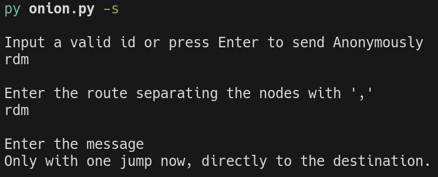
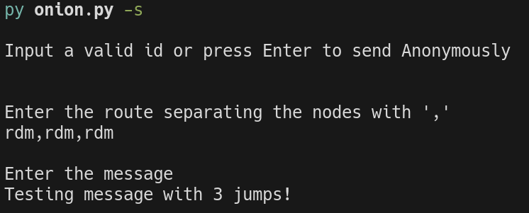
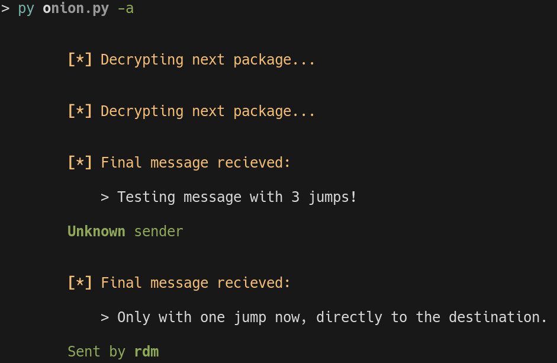
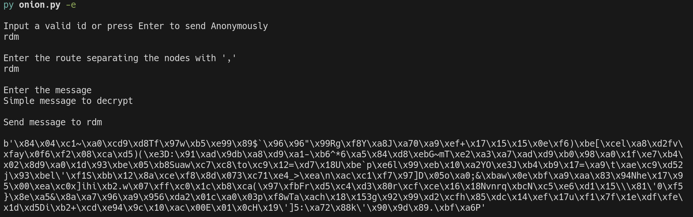
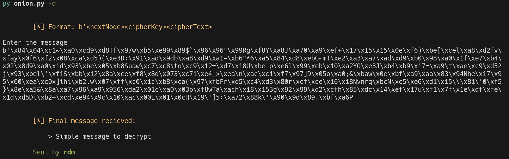
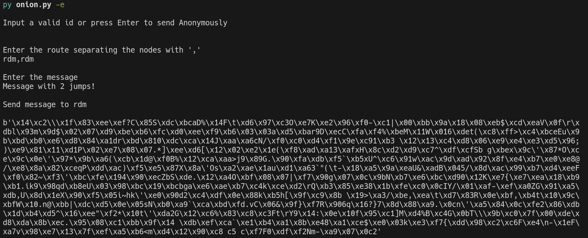
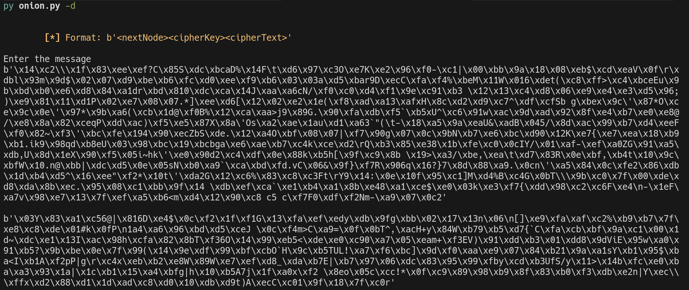

# Onion Routing

- Made by **Rubén Diz Martínez**

## :scroll: Description

A proof of concept implementation of **onion routing** for secure, multi-hop message transmission. By utilizing an MQTT message broker as the central forwarder, this project enables agents to *encrypt*, *route* and *decrypt* arbitrary messages while preserving anonymity.

Key Features:

- **Nested Encryption**: Messages are wrapped in multiple layers of encryption to ensure only the final recipient can read the payload.
- **MQTT Integration**: Uses a MQTT broker to handle the forwarding of messages between nodes.
- **Customizable Routing**: Senders can define specific, multi-hop forwarding paths (s -> h1 -> h2 -> ... -> r).
- **Advanced Anonymity**: Routes can be arbitrarily long, completely randomized and may include loops to obscure traffic patterns.

## :file_folder: Folder Structure

```text
.
├── README.md
├── requirements.txt
└── src
    ├── colors.py
    ├── config.py
    ├── crypto.py
    ├── decrypt.py
    ├── encrypt.py
    ├── onion.py
    ├── prints.py
    └── pubkeys.py
```

## :clipboard: Prerequisites

- Python 3.11+
- An active MQTT Broker (e.g., Mosquitto)

## :wrench: Installation

1. Move to src and create a virtual environment.

```sh
cd src
python -m venv venv
```

2. Next run:

```sh
# Linux/MacOS
source venv/bin/activate 
```

```powershell
# Windows
venv\Scripts\activate
```

> [!WARNING]
> In case we get a **UnauthorizedAccess** error in Windows, we can enter:
> `Set-ExecutionPolicy -ExecutionPolicy RemoteSigned -Scope CurrentUser`

3. Then install the requirements.

```sh
pip install -r ../requirements.txt
```

## :gear: Configuration

Modify the [config.py](<src/config.py>) file with the required configuration.

```py
MYNODE= # Node ID
KEYLEN= # Node key length

MQTT_USER= # MQTT User
MQTT_PASSWD= # MQTT Password
MQTT_IP= # MQTT IP
MQTT_PORT= # MQTT Port
```

Add or modify the public keys in the `pubkeydictionary` inside [pubkeys.py](<src/pubkeys.py>).

Then create a folder `keys` inside [src](<src>) and add both private and public `ssh-rsa` keys with the following format (being **aaa** the Node ID):

- Public key = aaa.pub
- Private key = aaa

## :computer: Usage

Using python the code can be executed with one of the following options (a help menu is provided):

> [!NOTE]
> It is recommended to leave one terminal with the `--activate` option while using another terminal to send messages with `--send`.

```sh
usage: onion.py [options]
    options:
        -a, --activate          Starts the MQTT to recieve messages
        -e, --encrypt text      Encrypts a given text and returns the result
        -d, --decrypt text      Decrypts a given ciphertext and returns the result
        -s, --send message      Encrypts and sends a message
```

### Examples

Here are a couple of simple examples showing how this works, whether using a *multi-hop* route or a *direct* message. *(Note: Direct messages are shown here just for testing purposes, a standard onion routing flow should involve at least three hops).*

#### 1. Automated Sending and Receiving

Sending a simple message                             |  Sending a message with multiple jumps
:---------------------------------------------------:|:------------------------------------------------------------------:
  |  



> **Note:** In these examples, a single machine is simulating multiple nodes for simplicity. In a real scenario, distinct machines with different Node IDs would function exactly the same way.

#### 2. Manual Encryption and Decryption

This program also allows you to *manually encrypt* a payload, transmit it through external channels (other than MQTT) and *decrypt it later*:

Encrypting a simple direct message                                |  Decrypting the simple direct message
:----------------------------------------------------------------:|:-------------------------------------------------------------------------------:
  |  

Encrypting a message with more than one jump                               |  Decrypting a message with more than one jump remaining
:-------------------------------------------------------------------------:|:----------------------------------------------------------------------------------------:
  |  

## :incoming_envelope: Contact me

<p>
  <a href="mailto:ruben.diz@udc.es?subject=[GitHub]%20Toma%20de%20contacto&body=Hola%20Rub%C3%A9n%2C%0A%0AMe%20dirijo%20a%20ti%20hoy%20despu%C3%A9s%20de%20ver%20tu%20perfil%20de%20GitHub%20para%20..."></a>
  <a href="https://www.linkedin.com/in/rub%C3%A9n-diz-mart%C3%ADnez-ab1a17254"></a>
  <a href="https://github.com/Rubi960"></a>
</p>